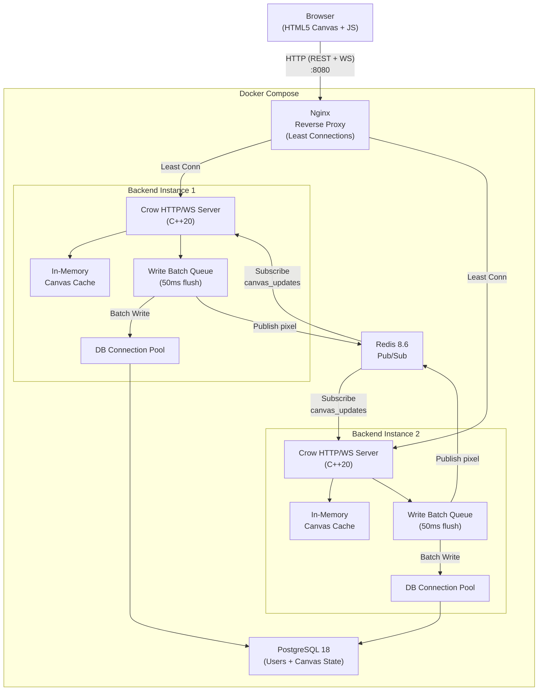
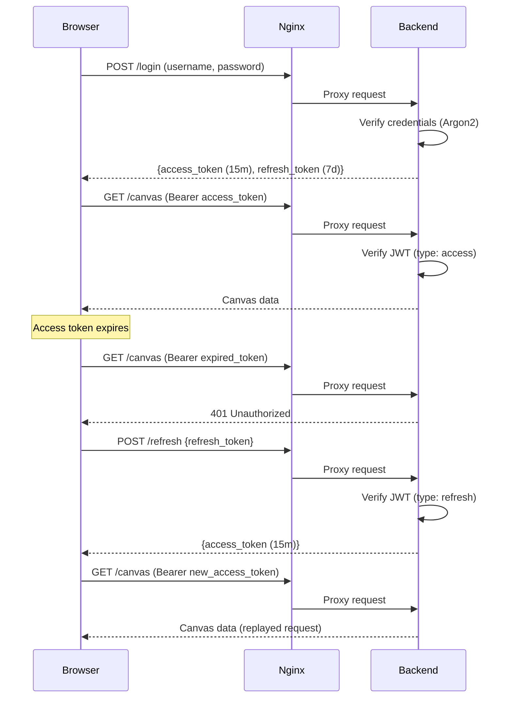

# PixelCanvas: Distributed Collaborative Canvas

PixelCanvas is a fault-tolerant, real-time, distributed clone of r/place. It allows multiple users to paint simultaneously on a shared 50x50 grid. The system is designed for high concurrency and fault tolerance.

## Architecture & Scalability

The system uses a low-latency, "read-optimized" architecture designed to handle thousands of concurrent users:

*   **In-Memory Cache:** The backend serves the 50x50 canvas directly from memory, eliminating database scans for the read path.
*   **Write Batching:** Pixel updates are queued and persisted to the PostgreSQL database in batches every 50ms to reduce I/O overhead.
*   **Real-Time Synchronization:** Redis Pub/Sub synchronizes state across multiple backend instances behind a least-connections Nginx load balancer.
*   **Fault Tolerance:** Automatic database connection pooling with a 2-second timeout and health checks ensures resilience during node failures or restarts.

## System Architecture



### Auth Flow (Access + Refresh Tokens)



## Performance Benchmarks

*   **Extreme Scalability:** 1,000 concurrent Virtual Users (VUs) with a 99.98% success rate.
*   **Throughput:** 101,449+ pixel updates per second broadcasted via Redis with 1,000 concurrent VUs.
*   **Low Latency:** 2.07ms - 5.12ms average request duration at baseline load (100 VUs).
*   **Efficiency:** 2.2GB of real-time JSON traffic handled under high load (500 VUs).

## Features

*   **Distributed Backends:** Scalable C++ instances behind Nginx.
*   **JWT Security:** Access/refresh token authentication with automatic token renewal. Passwords hashed with Argon2 (libsodium).
*   **Persistent Storage:** PostgreSQL stores user accounts and the canvas state.
*   **Docker-Ready:** Deploys with a single command via Docker Compose.

## Technical Stack

*   **Frontend:** HTML5 Canvas, Vanilla JS, CSS
*   **Backend:** C++20 (Crow Microframework)
*   **Database:** PostgreSQL 18
*   **Messaging:** Redis 8.6
*   **Auth:** Argon2 (libsodium), JWT (jwt-cpp)
*   **Orchestration:** Docker, Nginx

## Prerequisites

*   **Docker** and **Docker Compose**

## Environment Variables

| Variable | Description |
|---|---|
| `JWT_SECRET` | Secret key for signing JWT tokens |
| `POSTGRES_USER` | PostgreSQL username |
| `POSTGRES_PASSWORD` | PostgreSQL password |
| `POSTGRES_DB` | PostgreSQL database name |
| `DB_HOST` | PostgreSQL hostname (use `db` for Docker Compose) |

## Deployment

1.  **Configure Environment:** `cp .env.example .env` and fill in the variables above.
2.  **Run with Docker Compose:** `docker-compose up --build -d`
3.  **Access App:** `http://localhost:8080`

## API Reference

| Method | Endpoint | Auth | Description |
|---|---|---|---|
| `POST` | `/register` | None | Create a new user. Body: `{ "username", "password" }` |
| `POST` | `/login` | None | Authenticate and receive tokens. Returns `{ "access_token", "refresh_token" }` |
| `POST` | `/refresh` | None | Exchange a refresh token for a new access token. Body: `{ "refresh_token" }` |
| `GET` | `/canvas` | Bearer (access) | Retrieve the full 50x50 canvas state as JSON |
| `WS` | `/ws?token=<access_token>` | Query param | Real-time pixel updates. Send: `{ "x", "y", "color" }` |

## Testing

### Load Testing
To execute the load test using **k6**:
```bash
k6 run tests/loadtest.js
```
The test simulates a complete user lifecycle: registration, login, canvas retrieval, and real-time drawing via WebSockets.

### Failover Demo
Stop a backend instance: `docker stop pixelcanvas-backend1-1`. The system will continue to function as Nginx reroutes traffic and clients automatically reconnect.
